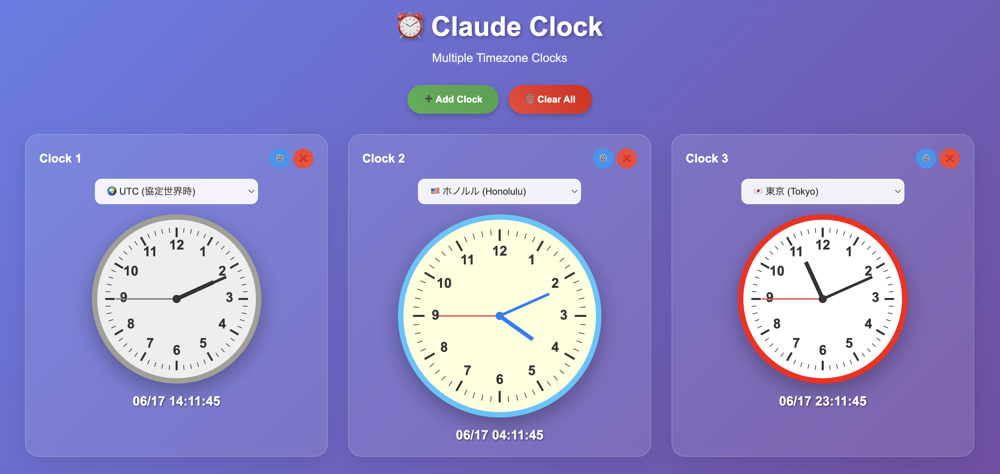

# ⏰ Claude Clock

JavaScriptとSVGで作られた美しく実用的なアナログ時計Webアプリケーション

## ✨ 特徴

- 🎨 **美しいデザイン**: 紫のグラデーション背景に白い文字盤の洗練されたアナログ時計
- 🌍 **グローバル対応**: 世界10都市のタイムゾーンに対応
- ⚡ **リアルタイム更新**: 正確な時刻表示とスムーズなアニメーション
- 📱 **レスポンシブ**: デスクトップ・タブレット・モバイル対応
- 🚀 **軽量**: 外部依存なし、シングルHTMLファイル

## 🎯 デモ



### 対応タイムゾーン

- UTC (協定世界時)
- London (ロンドン)
- Berlin (ベルリン)
- Paris (パリ)
- Shanghai (上海)
- Tokyo (東京)
- Sydney (シドニー)
- Honolulu (ホノルル)
- Los Angeles (ロサンゼルス)
- New York (ニューヨーク)

## 🚀 使い方

### 基本的な使用方法

1. **ファイルを開く**
   ```bash
   # ローカルサーバーで起動
   python -m http.server 8000
   # ブラウザで http://localhost:8000 を開く
   ```

2. **タイムゾーン選択**
   - タイトル下のドロップダウンから任意の都市を選択
   - 時計の針と表示が即座に選択したタイムゾーンに変更

3. **時刻確認**
   - アナログ時計で直感的な時刻把握
   - デジタル表示で正確な日時確認（MM/DD HH:MM:SS 形式）

### ブラウザで直接開く

HTMLファイルをブラウザで直接開くだけでも動作します。

## 🛠️ 技術仕様

### 使用技術

- **HTML5**: 構造とレイアウト
- **CSS3**: スタイリングとアニメーション
- **JavaScript ES6+**: 時刻計算とDOM操作
- **SVG**: 高品質なアナログ時計描画

### 主要機能

#### 1. 正確な針角度計算
```javascript
// 短針（時針）
const hourAngle = (hours % 12) * 30 + (minutes * 0.5) + 90;

// 長針（分針）
const minuteAngle = minutes * 6 + 90;

// 秒針
const secondAngle = seconds * 6 + 90;
```

#### 2. タイムゾーン対応
```javascript
// Intl.DateTimeFormat API使用
const now = new Date();
const timeInZone = new Intl.DateTimeFormat('en-US', {
  timeZone: selectedTimezone,
  hour12: false,
  hour: '2-digit',
  minute: '2-digit',
  second: '2-digit'
}).format(now);
```

#### 3. 動的数字配置
```javascript
// 角度計算による正確な位置配置
for(let i = 1; i <= 12; i++) {
  const angle = (i * 30 - 90) * Math.PI / 180;
  const x = centerX + radius * Math.cos(angle);
  const y = centerY + radius * Math.sin(angle);
}
```

## 📁 ファイル構成

```
claude-clock/
├── index.html          # メインアプリケーション
├── README.md           # このファイル
├── history.md          # 開発履歴
└── screenshot.png      # アプリケーションスクリーンショット
```

## 🎨 デザインシステム

### カラーパレット

- **背景**: 紫のグラデーション（#6B73FF → #9B59B6）
- **文字盤**: 清潔な白色（#FFFFFF）
- **針**: ダークグレー（短針・分針）、赤色（秒針）
- **文字**: 読みやすい黒色

### レスポンシブ対応

- デスクトップ: フル機能表示
- タブレット: 最適化されたサイズ
- モバイル: タッチフレンドリーな操作

## 🔧 カスタマイズ

### 新しいタイムゾーンの追加

```javascript
// timezonesオブジェクトに追加
const timezones = {
  // 既存のタイムゾーン...
  'Asia/Seoul': 'Seoul',
  'America/Chicago': 'Chicago'
};
```

### デザインの変更

```css
/* 背景色の変更 */
body {
  background: linear-gradient(135deg, #新色1, #新色2);
}

/* 時計サイズの調整 */
#clock {
  width: 好みのサイズpx;
  height: 好みのサイズpx;
}
```

## 🚀 開発履歴

詳細な開発過程は [history.md](history.md) をご参照ください。

### 主要マイルストーン

- ✅ 基本アナログ時計実装
- ✅ 針角度計算の精密調整
- ✅ タイムゾーン選択機能
- ✅ UI/UXの最適化
- ✅ デジタル表示の拡張

## 🤝 貢献

プルリクエストや機能提案を歓迎します。

### 開発環境

```bash
# リポジトリのクローン
git clone https://github.com/YOUR_USERNAME/claude-clock.git
cd claude-clock

# ローカルサーバー起動
python -m http.server 8000
```

## 📄 ライセンス

MIT License

## 🙏 謝辞

このプロジェクトは、Claude Code エージェント通信システムを使用して、AIチームの協力により開発されました。

---

**Created with ❤️ using Claude Code**
